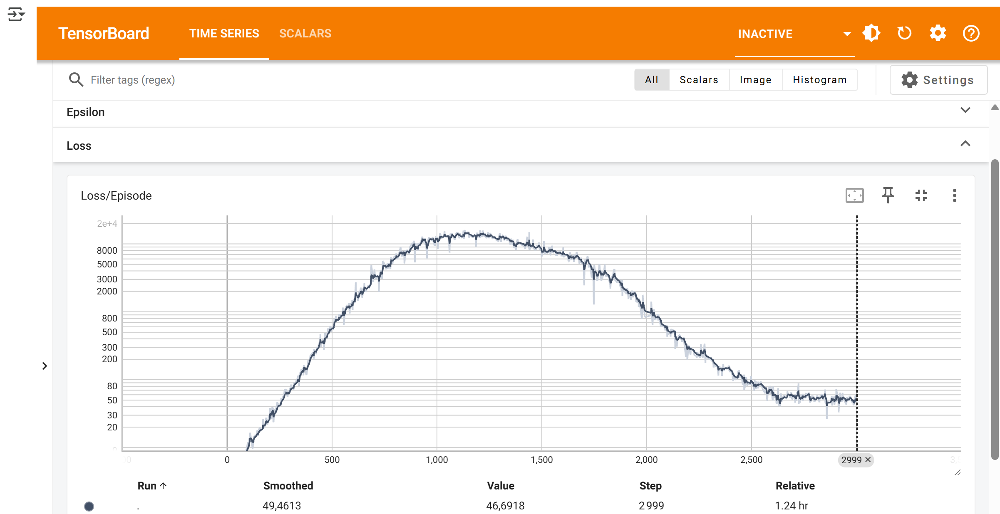
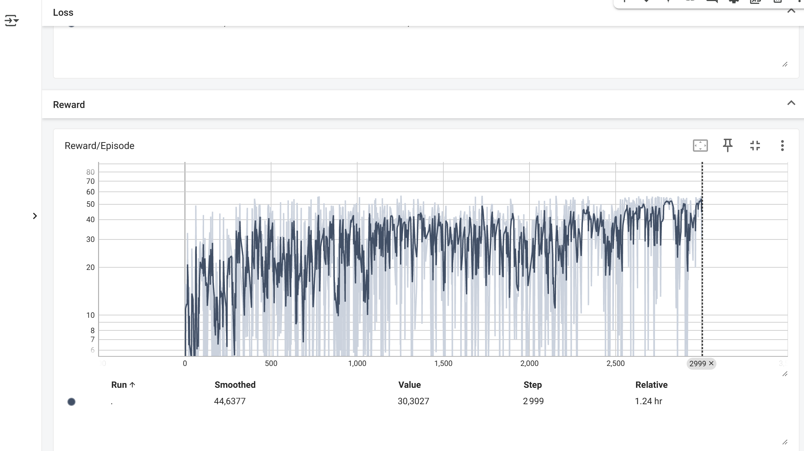
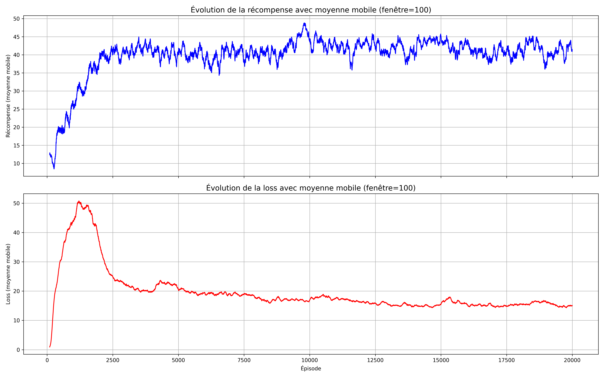
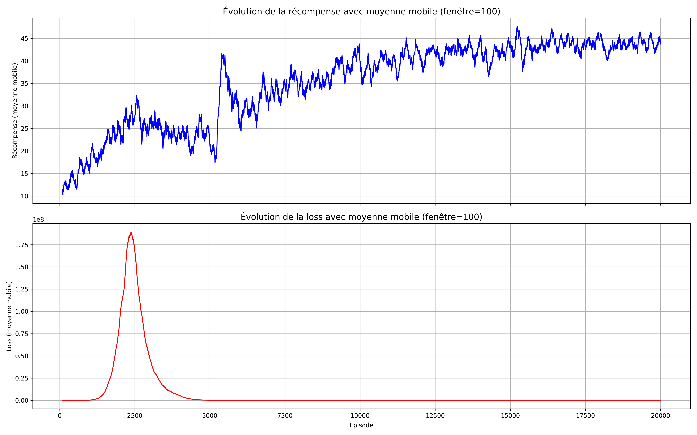
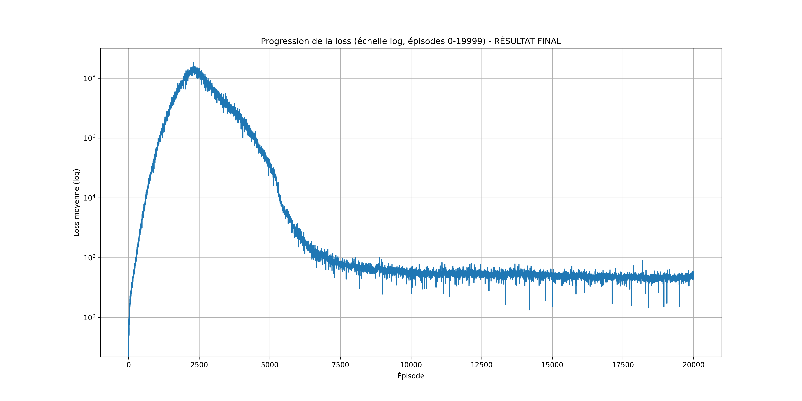
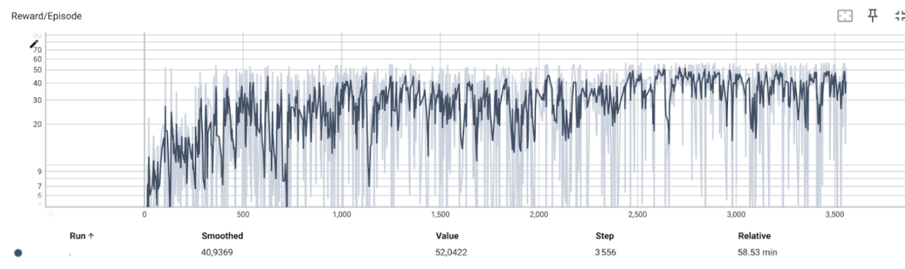
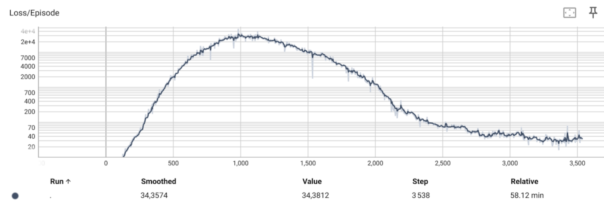

# Tâche 1 : DQN pour l'environnement Highway

## Introduction

Ce dossier contient l'implémentation d'un agent DQN (Deep Q-Network) pour résoudre l'environnement Highway-env. Nous avons testé deux architectures de réseaux de neurones différentes pour le DQN:
1. **SimpleNet** : Un réseau de neurones entièrement connecté (fully connected)
2. **ConvNet** : Un réseau de neurones convolutif adapté aux données de grille d'occupation

Pour cela on à 2 fichier notebook dqn_highway_convNet.ipynb et dqn_highway_simpleNet.ipynb regroupant les différents test que nous avons réalisé.

## Architectures neuronales implémentées

### SimpleNet

La première architecture, SimpleNet, est un réseau de neurones entièrement connecté classique qui prend en entrée l'observation aplatie de l'environnement.

Cette architecture est composée de :
- Une couche d'entrée qui prend la grille d'occupation aplatie
- Une couche cachée de 128 neurones avec activation ReLU
- Une couche de sortie qui produit les Q-values pour chaque action possible

L'approche SimpleNet est conceptuellement plus simple mais peut manquer de capacité à capturer la structure spatiale des observations de type grille.

### ConvNet

La seconde architecture, ConvNet, utilise des couches convolutives pour traiter directement la structure 2D de la grille d'occupation.

Cette architecture est composée de :
- Une partie convolutive :
  - Une première couche convolutive (7 canaux d'entrée → 16 canaux), suivie d'une activation ReLU et d'un max pooling
  - Une seconde couche convolutive (16 canaux → 32 canaux), suivie d'une activation ReLU et d'un max pooling
- Une partie entièrement connectée :
  - Une couche cachée de 128 neurones avec activation ReLU
  - Une couche de sortie produisant les Q-values pour chaque action

L'architecture ConvNet est mieux adaptée pour traiter les informations spatiales des grilles d'occupation, permettant au réseau de détecter et d'exploiter les motifs spatiaux dans les données.

## Expérimentations

Nous avons exploré plusieurs configurations d'hyperparamètres pour optimiser les performances de nos modèles:

### SimpleNet (dqn_highway_simpleNet.ipynb)

Notre première implémentation basée sur le code du TP4 utilisait un réseau de neurones simple avec les hyperparamètres suivants:
- gamma = 0.99
- batch_size = 64
- buffer_capacity = 10000
- update_target_every = 100
- epsilon_start = 1.0
- decrease_epsilon_factor = 1000
- epsilon_min = 0.05
- learning_rate = 1e-3

Les résultats n'ont pas été satisfaisants en raison de la capacité limitée du réseau à traiter les données spatiales de la grille d'occupation.

### ConvNet (dqn_highway_convNet.ipynb)

Nous avons donc amélioré notre approche avec un réseau convolutif plus adapté à la structure 2D des observations.

#### 1. Configuration de base
- Learning rate: 1e-4
- Facteur d'exploration (decrease_epsilon_factor): 1500
- Nombre d'épisodes: 3000

  
  

Cette première approche a montré des performances prometteuses. Toutefois, l'agent évitait souvant la voie de droite (pourtant récompensée), suggérant un manque d'exploration.

#### 2. Configuration avec learning rate réduit
- Learning rate: 1e-5 (diminution pour plus de stabilité)
- Facteur d'exploration: 2000 (augmentation pour encourager la découverte de nouvelles stratégies)
- Nombre d'épisodes: 20000 (augmentation pour permettre une convergence complète)

  

#### 3. Configuration avec exploration maximisée
Pour déterminer l'impact de l'exploration sur les performances à long terme, nous avons testé:
- Learning rate: 1e-4
- Facteur d'exploration: 5000 (exploration beaucoup plus importante)
- Nombre d'épisodes: 20000

  

Visualisation de la loss avec échelle logarithmique:

  

Nos résultats montrent que:
1. Les entraînements sur 20 000 épisodes atteignent des performances significativement supérieures quand nous testons l'agent mais cependant la loss stagneà partir d'un certain seuil. 
2. Un learning rate réduit (1e-5) offre une meilleure stabilité comparé au 1e-4 qui fait donc beaucoup plus varié la loss pendant l'entrainement allant à des millions et redescendant très bas!
3. L'augmentation excessive du facteur d'exploration (5000 vs 2000) n'apporte pas réellement d'amélioration

#### 4. Configuration optimisée
En nous basant sur ces observations, nous avons développé une configuration hybride visant l'efficacité:
- Learning rate: 1e-5
- Facteur d'exploration: 1500
- Nombre d'épisodes: 3700

  
  

Cette configuration offre un excellent compromis entre temps d'entraînement et performance, en s'arrêtant approximativement au point où la loss commence à stagner.